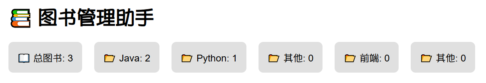

# 个人图书管理助手 - 中期报告

**项目名称：** 个人图书管理助手  
**学    院：** 计算机学院  
**小组序号：** 09  
**成员姓名：** 刘璟轩  
**指导老师：** 尹兆远  
**当前版本：** 中期  
**更新日期：** 2026年4月30日  

---

## 一、项目概述 【中期必填】

### 1. 项目背景
随着个人藏书和电子资料不断增多，如何高效管理图书信息成为实际问题。本项目开发一个轻量级的个人图书管理助手，帮助用户便捷地记录、查找和整理图书。

### 2. 系统目标
- 实现图书信息的增删改查（CRUD）功能
- 支持按分类、书名、作者进行检索
- 提供图书数量统计与分类分布展示
- 提供简洁易用的Web界面

### 3. 开发环境
| 项目 | 内容 |
|------|------|
| 操作系统 | Windows |
| 开发语言 | Python 3.12 |
| Web框架 | Flask |
| 数据库 | SQLite |
| 前端 | HTML + Jinja2 + JavaScript |
| 版本控制 | Git + GitHub |

---

## 二、需求分析 【中期必填】

### 1. 功能需求

**已实现功能清单：**

| 模块 | 功能 | 状态 |
|------|------|------|
| 图书列表 | 展示所有图书，支持表格显示 | ✅ 已完成 |
| 添加图书 | 录入书名、作者、ISBN、分类、位置、状态 | ✅ 已完成 |
| 编辑图书 | 修改已有图书信息 | ✅ 已完成 |
| 删除图书 | 删除不需要的图书 | ✅ 已完成 |
| 搜索功能 | 按书名或作者模糊搜索 | ✅ 已完成 |
| 统计看板 | 显示总图书数、各分类图书数量 | ✅ 已完成 |
| 分类管理 | 预设5个分类（Java/Python/数据库/前端/其他） | ✅ 已完成 |

**业务流程：**
1. 用户进入首页，查看所有图书列表
2. 点击"添加图书"按钮，填写表单提交
3. 点击"编辑"按钮修改图书信息
4. 点击"删除"按钮移除图书
5. 在搜索框输入关键词筛选图书
6. 页面顶部实时显示统计信息

### 2. 非功能需求
- **性能要求**：页面响应时间 < 2秒 ✅ 满足
- **安全要求**：使用参数化查询防止SQL注入 ✅ 满足
- **兼容性要求**：支持Chrome/Edge浏览器 ✅ 满足

---

## 三、系统设计 【中期必填】

### 1. 系统架构

```
┌─────────────────────────────────────────┐
│           浏览器 (Chrome/Edge)           │
│         HTML/CSS/JavaScript              │
└─────────────────┬───────────────────────┘
                  │ HTTP 请求/响应
                  ▼
┌─────────────────────────────────────────┐
│           Flask 后端 (Python)            │
│  - 路由处理 (GET/POST)                   │
│  - 模板渲染 (Jinja2)                     │
│  - 业务逻辑处理                          │
└─────────────────┬───────────────────────┘
                  │ SQL 查询
                  ▼
┌─────────────────────────────────────────┐
│           SQLite 数据库                  │
│  - book 表（图书信息）                   │
│  - category 表（分类信息）               │
└─────────────────────────────────────────┘
```

**架构说明：**
- 表现层：HTML模板 + 原生JavaScript处理前端交互
- 业务逻辑层：Flask视图函数处理请求、数据验证
- 数据访问层：sqlite3模块执行参数化查询

### 2. 模块设计

| 模块 | 文件 | 职责 |
|------|------|------|
| 图书列表模块 | main.py - index() | 展示所有图书，支持搜索 |
| 添加图书模块 | main.py - add_book() | 接收表单数据，插入数据库 |
| 编辑图书模块 | main.py - get_book(), update_book() | 获取图书信息，更新数据库 |
| 删除图书模块 | main.py - delete_book() | 删除指定ID的图书 |
| 统计模块 | main.py - stats() | 返回图书总数和分类统计 |
| 前端交互 | index.html | 页面展示、表单提交、AJAX请求 |

### 3. 数据库设计

**E-R 图：**

```
┌─────────────┐       ┌─────────────────────────┐
│  category   │       │         book            │
├─────────────┤       ├─────────────────────────┤
│ id (PK)     │◄──────│ category_id (FK)        │
│ name        │       │ id (PK)                  │
└─────────────┘       │ title                    │
                      │ author                   │
                      │ isbn                     │
                      │ location                 │
                      │ status                   │
                      └─────────────────────────┘

关系：一个分类 → 多本图书 (一对多)
```

**建表SQL脚本：** 详见 `sql/schema.sql`

#### 主要数据表设计

| 表名 | 字段 | 类型 | 说明 |
|------|------|------|------|
| category | id | INTEGER | 主键，自增 |
| category | name | TEXT | 分类名称，唯一 |
| book | id | INTEGER | 主键，自增 |
| book | title | TEXT | 书名 |
| book | author | TEXT | 作者 |
| book | isbn | TEXT | ISBN号 |
| book | category_id | INTEGER | 外键，关联category.id |
| book | location | TEXT | 存放位置 |
| book | status | TEXT | 阅读状态（未读/在读/已读） |
| book | created_at | TIMESTAMP | 创建时间 |

---

## 四、系统实现 【中期部分填写】

### 1. 关键技术

| 技术 | 用途 | 说明 |
|------|------|------|
| Flask | Web框架 | 轻量级Python框架，处理HTTP请求和路由 |
| SQLite | 数据库 | 嵌入式数据库，无需单独安装服务 |
| Jinja2 | 模板引擎 | 动态生成HTML页面 |
| Fetch API | AJAX请求 | 实现异步数据交互，无需刷新页面 |

**技术难点解决方案：**
- SQL注入防护：使用参数化查询 `?` 占位符
- 数据持久化：SQLite自动保存，无需额外配置
- 前端交互：原生JavaScript实现弹窗表单和AJAX提交

### 2. 界面展示

#### 图书列表主页


*图1：图书列表主页，展示所有图书及统计看板*

#### 添加图书弹窗


*图2：点击"添加图书"按钮后弹出的表单*

#### 编辑图书弹窗


*图3：点击"编辑"按钮后弹出的表单，数据自动填充*

#### 统计看板


*图4：页面顶部的统计看板，显示图书总数和各分类数量*

#### 搜索功能


*图5：按关键词搜索图书的结果*

### 3. 核心代码片段

**数据库连接（main.py）：**
```python
def get_db():
    conn = sqlite3.connect(DB_PATH)
    conn.row_factory = sqlite3.Row
    return conn
```

**参数化查询示例（防止SQL注入）：**
```python
books = conn.execute(
    "SELECT book.*, category.name as category_name FROM book "
    "LEFT JOIN category ON book.category_id = category.id "
    "WHERE book.title LIKE ? OR book.author LIKE ?",
    (f'%{search}%', f'%{search}%')
).fetchall()
```

---

## 五、系统测试 【中期写方案】

### 1. 测试方案

| 测试类型 | 测试范围 | 测试方法 |
|----------|----------|----------|
| 功能测试 | 增删改查、搜索、统计 | 手动执行测试用例 |
| 兼容性测试 | Chrome/Edge浏览器 | 在不同浏览器中验证 |
| 边界测试 | 空数据、特殊字符、超长文本 | 输入异常数据验证 |

**准备执行的测试用例：**

| 用例ID | 测试项 | 输入 | 预期结果 |
|--------|--------|------|----------|
| TC-01 | 添加图书 | 书名=《Python入门》，作者=廖雪峰 | 图书出现在列表中 |
| TC-02 | 搜索图书 | 搜索关键词"Python" | 只显示相关图书 |
| TC-03 | 编辑图书 | 修改状态为"已读" | 状态更新成功 |
| TC-04 | 删除图书 | 点击删除按钮 | 图书从列表中移除 |
| TC-05 | 空搜索 | 搜索框留空 | 显示所有图书 |

### 2. 测试结果
> 待结项阶段补全真实测试结果

### 3. 问题与改进
> 待结项阶段补全发现的问题

---

## 六、用户手册 【结项补全】
> 此部分在结项阶段完成

---

## 七、项目总结 【中期先写阶段总结】

### 1. 阶段成果
- ✅ 完成数据库设计（category表和book表）
- ✅ 完成Flask后端API开发（增删改查、搜索、统计）
- ✅ 完成前端页面开发（列表展示、弹窗表单、统计看板）
- ✅ 系统可正常运行，核心功能完整

### 2. 当前问题
- 界面样式较为简单，可进一步美化
- 缺少分页功能（图书较多时影响体验）
- 缺少数据导出功能

### 3. 下一步计划
1. 美化界面样式
2. 添加分页功能
3. 完善测试并记录结果
4. 完成软件说明书撰写

### 4. 成员分工表
| 姓名 | 班级 | 学号 | Git账号 | 承担任务 |
|------|------|------|---------|----------|
| 刘璟轩 | 24级计科二班 | 202405710919 | immortal-water | 全栈开发、数据库设计、文档编写、测试 |

### 5. Git 提交记录
| 提交时间 | 提交说明 |
|----------|----------|
| 2026年4月 | 初始化项目结构 |
| 2026年4月 | 完成项目计划书 |
| 2026年4月 | 完成Flask后端开发 |
| 2026年4月 | 完成前端页面和模板 |
| 2026年4月 | 集成搜索和统计功能 |

---

## 附录

### 1. 参考资料
- Flask官方文档：https://flask.palletsprojects.com/
- SQLite官方文档：https://sqlite.org/docs.html
- GitHub：https://github.com/immortal-water/iw_book_manager

### 2. 运行说明
```bash
pip install flask
python main.py
# 访问 http://127.0.0.1:8000
```