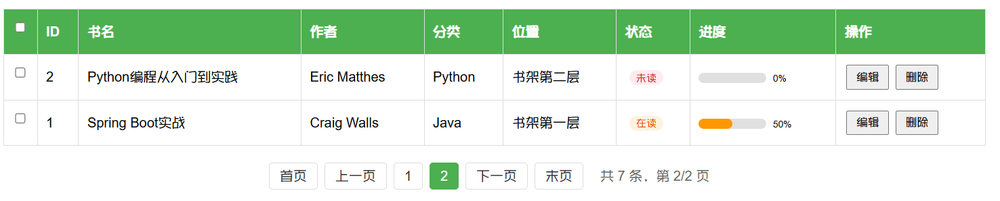
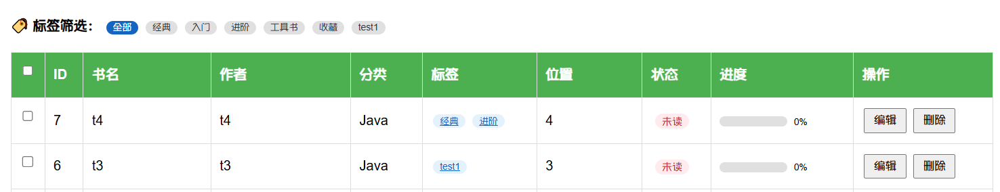
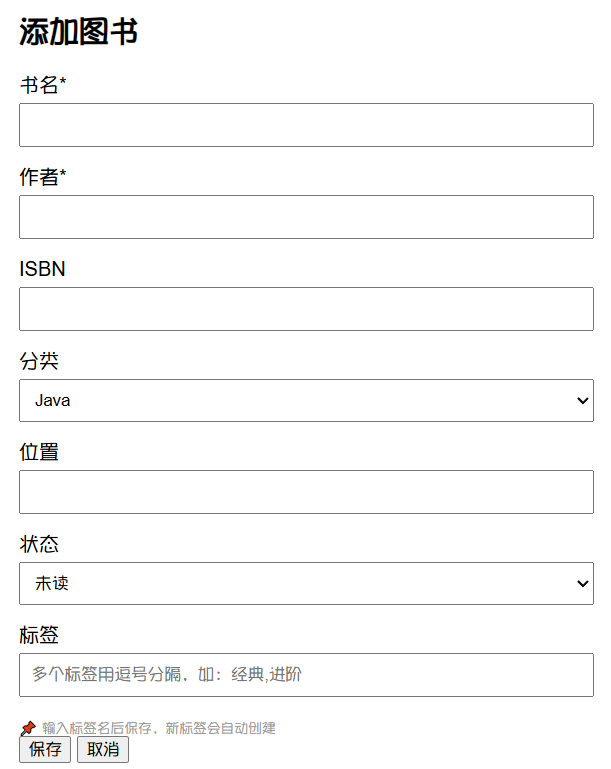

# 个人图书管理助手 - 中期报告

**项目名称：** 个人图书管理助手  
**学　　院：** 计算机学院  
**小组序号：** 09  
**成员姓名：** 刘璟轩、李淑湘、程智鸿、旷凯翔  
**指导老师：** 尹兆远  
**更新日期：** 2026 年 5 月 11 日  

---

## 一、项目概述

### 1. 项目背景

随着个人藏书和电子资料不断增多，如何高效管理图书信息成为实际问题。现有的通用笔记或表格工具缺乏针对图书管理专门优化，无法满足分类检索、状态跟踪等需求。本项目旨在开发一个轻量级的个人图书管理助手，帮助用户便捷地记录、查找和整理图书。

### 2. 系统目标

- 实现图书信息的增删改查（CRUD）功能
- 支持按分类、书名、作者进行检索
- 提供图书数量统计与分类分布展示
- 提供简洁易用的 Web 界面

### 3. 开发环境

| 项目 | 内容 |
|------|------|
| 操作系统 | Windows |
| 开发语言 | Python 3.12 |
| Web 框架 | Flask |
| 数据库 | SQLite |
| 前端 | HTML + Jinja2 + JavaScript |
| 版本控制 | Git + GitHub |

---

## 二、需求分析

### 1. 功能需求

**功能清单：**

| 模块 | 功能 | 状态 |
|------|------|------|
| 图书列表 | 展示所有图书，支持表格显示 | ✅ 已完成 |
| 添加图书 | 录入书名、作者、ISBN、分类、位置、状态 | ✅ 已完成 |
| 编辑图书 | 修改已有图书信息 | ✅ 已完成 |
| 删除图书 | 单本删除 | ✅ 已完成 |
| 批量删除 | 勾选多本图书后一键删除 | ✅ 已完成 |
| 搜索功能 | 按书名或作者模糊搜索 | ✅ 已完成 |
| 状态筛选 | 按阅读状态（未读/在读/已读）筛选 | ✅ 已完成 |
| 统计看板 | 显示总图书数、各分类数量、各状态数量 | ✅ 已完成 |
| 分类管理 | 预设 5 个分类（Java/Python/数据库/前端/其他） | ✅ 已完成 |
| 数据导出 | 导出图书列表为 CSV 文件 | ✅ 已完成 |
| 阅读进度 | 总体阅读进度条 + 每本图书迷你进度条 | ✅ 已完成 |
| 分页功能 | 每页5条，页码导航，首页/末页跳转 | ✅ 已完成 |
| 标签系统 | 自定义标签，多对多关联，标签筛选 | ✅ 已完成 |

**业务流程：**

1. 用户进入首页，查看所有图书列表和统计看板
2. 页面顶部显示总体阅读进度条和状态统计
3. 标签筛选栏可快速按标签过滤图书
4. 点击"添加图书"按钮，填写表单提交（含标签输入）
5. 点击"编辑"按钮修改图书信息（含标签编辑）
6. 点击"删除"按钮移除单本图书
7. 勾选多本图书后点击"批量删除"一键移除
8. 在搜索框输入关键词筛选图书
9. 通过状态下拉框按阅读状态筛选图书
10. 搜索、状态筛选与标签筛选可组合使用
11. 每本图书显示阅读进度条，状态以彩色徽章展示
12. 图书较多时通过底部分页栏翻页浏览
13. 点击"导出 CSV"下载图书数据，导出全部数据不受分页影响

### 2. 非功能需求

- **性能要求**：页面响应时间 < 2 秒 ✅ 满足
- **安全要求**：使用参数化查询防止 SQL 注入 ✅ 满足
- **兼容性要求**：支持 Chrome/Edge 浏览器 ✅ 满足

---

## 三、系统设计

### 1. 系统架构


**架构说明：**

- 表现层：HTML 模板 + 原生 JavaScript 处理前端交互
- 业务逻辑层：Flask 视图函数处理请求、数据验证
- 数据访问层：sqlite3 模块执行参数化查询

### 2. 模块设计

| 模块 | 文件 | 职责 |
|------|------|------|
| 图书列表模块 | `main.py - index()` | 展示图书，支持搜索、状态筛选、标签筛选、分页，计算阅读进度 |
| 添加图书模块 | `main.py - add_book()` | 接收表单数据（含标签），插入数据库并建立标签关联 |
| 编辑图书模块 | `main.py - get_book(), update_book()` | 获取图书信息（含标签），更新数据库和标签关联 |
| 删除图书模块 | `main.py - delete_book()` | 删除指定 ID 的单本图书，级联删除标签关联 |
| 批量删除模块 | `main.py - batch_delete_books()` | 接收 ID 列表，批量删除图书 |
| 统计模块 | `main.py - stats()` | 返回图书总数、分类统计、状态统计、总体阅读进度 |
| 导出模块 | `main.py - export_csv()` | 导出全部图书为 CSV 文件，支持筛选条件 |
| 标签辅助模块 | `main.py - get_book_tags()` | 查询指定图书的标签列表 |
| 前端交互 | `index.html` | 页面展示、表单提交、AJAX 请求、批量操作、多条件筛选、进度条渲染、分页导航、标签显示与编辑 |

### 3. 数据库设计

**E-R 图：**


**建表SQL脚本：** 详见 `sql/schema.sql`，当 `book.db` 不存在时会自动调用。

#### 主要数据表设计

**分类表（category）：**

| 字段 | 类型 | 说明 |
|------|------|------|
| id | INTEGER | 主键，自增 |
| name | TEXT | 分类名称，唯一 |

**图书表（book）：**

| 字段 | 类型 | 说明 |
|------|------|------|
| id | INTEGER | 主键，自增 |
| title | TEXT | 书名 |
| author | TEXT | 作者 |
| isbn | TEXT | ISBN号 |
| category_id | INTEGER | 外键，关联 `category.id` |
| location | TEXT | 存放位置 |
| status | TEXT | 阅读状态（未读/在读/已读） |
| created_at | TIMESTAMP | 创建时间 |

**标签表（tag）：**

| 字段 | 类型 | 说明 |
|------|------|------|
| id | INTEGER | 主键，自增 |
| name | TEXT | 标签名称，唯一 |

**图书标签关联表（book_tag）：**

| 字段 | 类型 | 说明 |
|------|------|------|
| book_id | INTEGER | 外键，关联 `book.id`，级联删除 |
| tag_id | INTEGER | 外键，关联 `tag.id`，级联删除 |

图书与标签为多对多关系，通过 `book_tag` 关联表实现。

---

## 四、系统实现

### 1. 关键技术

| 技术 | 用途 | 说明 |
|------|------|------|
| Flask | Web框架 | 轻量级 Python 框架，处理 HTTP 请求和路由 |
| SQLite | 数据库 | 嵌入式数据库，首次运行自动建表，支持迁移脚本 |
| Jinja2 | 模板引擎 | 动态生成 HTML 页面 |
| Fetch API | AJAX请求 | 实现异步数据交互，无需刷新页面 |
| JSON API | 批量操作 | 前端通过 POST JSON 传递 ID 列表，后端批量处理 |
| CSV 模块 | 数据导出 | 导出全部图书数据为 CSV 文件，支持 Excel 打开 |
| 动态SQL构建 | 多条件筛选 | 根据搜索词、状态和标签参数动态拼接 WHERE 子句 |
| 进度计算 | 阅读进度 | 根据状态（未读/在读/已读）映射百分比，展示进度条 |
| LIMIT/OFFSET | 分页查询 | SQLite 分页语法，每页固定5条，动态计算偏移量 |
| 多对多关联 | 标签系统 | tag 表 + book_tag 关联表，支持灵活标签管理与子查询筛选 |

**技术难点解决方案：**

- SQL 注入防护：使用参数化查询 `?` 占位符
- 数据持久化：SQLite 自动保存，首次运行自动初始化
- 前端交互：原生 JavaScript 实现弹窗表单和 AJAX 提交
- 批量删除：前端收集选中 ID，通过 JSON 格式发送至后端，使用 `IN` 子句批量删除
- CSV 导出：写入 UTF-8 BOM 头解决 Excel 中文乱码问题
- 多条件筛选：后端动态构建 SQL WHERE 子句，搜索词、状态筛选和标签筛选可灵活组合
- 进度条可视化：后端计算进度百分比，前端通过 CSS 进度条和彩色徽章渲染
- 分页导航：后端计算总页数与偏移量，前端渲染页码按钮，支持省略号折叠
- 标签管理：输入标签名时自动查找已有标签或创建新标签，基于 `INSERT OR IGNORE` 避免重复关联

### 2. 界面展示

#### 图书列表主页


*图1：图书列表主页，展示所有图书及统计看板*

#### 添加图书弹窗


*图2：点击"添加图书"按钮后弹出的表单*

#### 编辑图书弹窗


*图3：点击"编辑"按钮后弹出的表单，数据自动填充*

#### 统计看板


*图4：页面顶部的统计看板，显示图书总数和各分类数量*

#### 搜索功能


*图5：按关键词搜索图书的结果*

#### 批量删除功能


*图6：勾选多本图书后，点击"批量删除"按钮一键删除*

#### 数据导出功能


*图7：点击"导出 CSV"按钮，浏览器自动下载图书数据文件*

#### 按状态筛选


*图8：通过状态下拉框按"未读/在读/已读"筛选图书，可与搜索组合使用*

#### 阅读进度条


*图9：总体阅读进度条（红/橙/绿三色）+ 每本图书的迷你进度条 + 状态彩色徽章*

#### 分页功能



*图10：图书列表底部的分页导航，支持首页/末页/页码跳转，当前页高亮，显示总条数*

#### 标签系统



*图11：标签筛选栏 + 表格中每本图书显示蓝色标签*



*图12：编辑时可输入自定义标签*

### 3. 核心代码片段

**数据库自动初始化（main.py）：**

```python
def init_db():
    schema_path = os.path.join(BASE_DIR, 'sql', 'schema.sql')
    if os.path.exists(schema_path):
        conn = sqlite3.connect(DB_PATH)
        with open(schema_path, 'r', encoding='utf-8') as f:
            conn.executescript(f.read())
        conn.commit()
        conn.close()
```

**三条件组合筛选（搜索+状态+标签）：**

```python
conditions = []
params = []
if search:
    conditions.append("(book.title LIKE ? OR book.author LIKE ?)")
    params.extend([f'%{search}%', f'%{search}%'])
if status_filter:
    conditions.append("book.status = ?")
    params.append(status_filter)
if tag_filter:
    conditions.append("book.id IN (SELECT book_id FROM book_tag WHERE tag_id = ?)")
    params.append(tag_filter)
where_clause = "WHERE " + " AND ".join(conditions) if conditions else ""
```

**标签查找或创建（main.py）：**

```python
tag = conn.execute("SELECT id FROM tag WHERE name = ?", (tag_name,)).fetchone()
if not tag:
    cursor = conn.execute("INSERT INTO tag (name) VALUES (?)", (tag_name,))
    tag_id = cursor.lastrowid
else:
    tag_id = tag['id']
conn.execute("INSERT OR IGNORE INTO book_tag (book_id, tag_id) VALUES (?, ?)", (book_id, tag_id))
```

**分页查询（main.py）：**

```python
PER_PAGE = 5
offset = (page - 1) * PER_PAGE
total_pages = max(1, math.ceil(total_count / PER_PAGE))
books = conn.execute(
    f"SELECT DISTINCT book.*, ... ORDER BY book.id DESC LIMIT ? OFFSET ?",
    params + [PER_PAGE, offset]
).fetchall()
```

**阅读进度计算（main.py）：**

```python
if book['status'] == '已读':
    progress = 100
elif book['status'] == '在读':
    progress = 50
else:
    progress = 0
```

**批量删除接口（main.py）：**

```python
@app.route('/book/batch_delete', methods=['POST'])
def batch_delete_books():
    data = request.get_json()
    ids = data.get('ids', [])
    if not ids:
        return jsonify({"success": False, "message": "未选择任何图书"})
    conn = get_db()
    placeholders = ','.join('?' for _ in ids)
    conn.execute(f"DELETE FROM book WHERE id IN ({placeholders})", ids)
    conn.commit()
    conn.close()
    return jsonify({"success": True, "deleted": len(ids)})
```

**CSV 导出接口（导出全部数据）：**

```python
@app.route('/export/csv')
def export_csv():
    output = io.StringIO()
    writer = csv.writer(output)
    output.write('\ufeff')
    writer.writerow(['ID', '书名', '作者', 'ISBN', '分类', '位置', '状态'])
    for book in books:
        writer.writerow([...])
    return Response(csv_content, mimetype='text/csv',
        headers={'Content-Disposition': 'attachment; filename=books_export.csv'})
```

---

## 五、系统测试

### 1. 测试方案

| 测试类型 | 测试范围 | 测试方法 |
|----------|----------|----------|
| 功能测试 | 增删改查、批量删除、搜索、状态筛选、标签筛选、统计、导出、进度条、分页 | 手动执行测试用例 |
| 兼容性测试 | Chrome/Edge 浏览器 | 在不同浏览器中验证 |
| 边界测试 | 空数据、特殊字符、超长文本、分页边界、标签重复 | 输入异常数据验证 |

**准备执行的测试用例：**

| 用例ID | 测试项 | 输入 | 预期结果 |
|--------|--------|------|----------|
| TC-01 | 添加图书 | 书名 =《Python入门》，作者 = 廖雪峰，标签 = 入门, 经典 | 图书出现在列表中，显示两个标签 |
| TC-02 | 搜索图书 | 搜索关键词 "Python" | 只显示相关图书 |
| TC-03 | 编辑图书 | 修改状态为 "已读"，修改标签 | 状态更新，进度条100%绿色，标签更新 |
| TC-04 | 删除图书 | 点击删除按钮 | 图书从列表中移除，标签关联自动清理 |
| TC-05 | 空搜索 | 搜索框留空 | 显示所有图书 |
| TC-06 | 批量删除 | 勾选2本图书，点击批量删除 | 选中的2本图书被移除 |
| TC-07 | 导出CSV | 点击导出按钮 | 浏览器下载 CSV 文件，包含全部数据 |
| TC-08 | 全选删除 | 点击全选复选框，批量删除 | 当前页选中图书被移除 |
| TC-09 | 状态筛选 | 选择状态"未读" | 只显示未读图书 |
| TC-10 | 组合筛选 | 搜索"Python" + 状态"已读" | 显示匹配两个条件的图书 |
| TC-11 | 筛选后导出 | 状态筛选后点击导出 | CSV 内容与筛选结果一致 |
| TC-12 | 进度条显示 | 系统存在不同状态的图书 | 总体进度条正常显示，单本迷你进度条与状态一致 |
| TC-13 | 全部已读 | 将所有图书状态改为已读 | 总体进度条显示100%绿色 |
| TC-14 | 分页显示 | 添加超过5本图书 | 第1页显示5条，底部出现分页导航 |
| TC-15 | 页码跳转 | 点击"下一页"或页码数字 | 正确跳转到对应页面 |
| TC-16 | 首页/末页 | 点击"首页"或"末页"按钮 | 跳转到第1页或最后1页 |
| TC-17 | 分页+筛选 | 搜索后结果超过5条 | 分页仅对筛选结果生效，页码正确 |
| TC-18 | 空数据页 | 删除全部图书后访问 | 显示"暂无图书数据" |
| TC-19 | 标签筛选 | 点击标签筛选栏"经典" | 只显示含有"经典"标签的图书 |
| TC-20 | 标签+搜索 | 标签筛选 + 关键词搜索 | 显示同时满足两个条件的图书 |
| TC-21 | 新增标签 | 编辑时输入不存在的标签名 | 自动创建新标签并关联 |

### 2. 测试结果
> 待结项阶段补全真实测试结果

### 3. 问题与改进
> 待结项阶段补全发现的问题

---

## 六、用户手册
> 此部分在结项阶段完成

---

## 七、项目总结

### 1. 阶段成果
- ✅ 完成数据库设计（category 表、book 表、tag 表、book_tag 关联表）
- ✅ 完成 Flask 后端 API 开发（增删改查、批量删除、搜索、状态筛选、标签筛选、统计、导出）
- ✅ 完成前端页面开发（列表展示、弹窗表单、统计看板、批量操作、多条件筛选、进度条、分页、标签显示与编辑）
- ✅ 实现首次运行自动建表，简化部署流程
- ✅ 实现数据库迁移脚本，已有数据可无缝升级
- ✅ 实现三条件组合筛选（搜索 + 状态 + 标签）
- ✅ 实现阅读进度条可视化（总体进度条 + 单本迷你进度条 + 状态彩色徽章）
- ✅ 实现分页功能（每页5条，页码导航，首页/末页快捷跳转，页码折叠省略）
- ✅ 实现自定义标签系统（多对多关联，标签筛选，自动创建标签，级联删除）
- ✅ 全部 6 个扩展功能已完成，系统功能完整

### 2. 当前问题
- 界面样式较为简单，可进一步美化

### 3. 下一步计划
1. 完善测试并记录结果
2. 完成软件说明书撰写
3. 准备结项汇报材料

### 4. 成员分工表
| 姓名 | 班级 | 学号 | Git账号 | 承担任务 |
|------|------|------|---------|----------|
| 刘璟轩 | 24级计科二班 | 202405710919 | immortal-water | 前端开发、后端开发、数据库设计 |
| 李淑湘 | 24级计科菁英班 | 202405550312 | fdkshvn | 需求分析、功能设计 |
| 程智鸿 | 24级计科菁英班 | 202405550303 | chengzhihong-ai | 测试，文档撰写 |
| 旷凯翔 | 24级计科三班 | 202305567026 | 5201314kkxkkxkkx | 测试，文档撰写 |

### 5. Git 提交记录
| 提交时间 | 提交说明 |
|----------|----------|
| 2026 年 4 月 29 日 | 初始化项目结构 |
| 2026 年 4 月 29 日 | 完成项目计划书 |
| 2026 年 4 月 29 日 | 完成 Flask 后端开发 |
| 2026 年 4 月 30 日 | 完成前端页面和模板 |
| 2026 年 4 月 30 日 | 集成搜索和统计功能 |
| 2026 年 5 月 9 日 | 重写报告和计划书使其规范 |
| 2026 年 5 月 10 日 | 实现数据导出 CSV 功能 |
| 2026 年 5 月 10 日 | 实现批量删除功能 |
| 2026 年 5 月 10 日 | 实现按阅读状态筛选功能 |
| 2026 年 5 月 11 日 | 实现阅读进度条可视化功能 |
| 2026 年 5 月 11 日 | 实现分页功能（每页5条，页码导航） |
| 2026 年 5 月 11 日 | 实现自定义标签系统（标签筛选，自动创建标签） |

---

## 附录

### 1. 参考资料

- Flask官方文档：https://flask.palletsprojects.com/
- SQLite官方文档：https://sqlite.org/docs.html
- GitHub：https://github.com/immortal-water/iw_book_manager