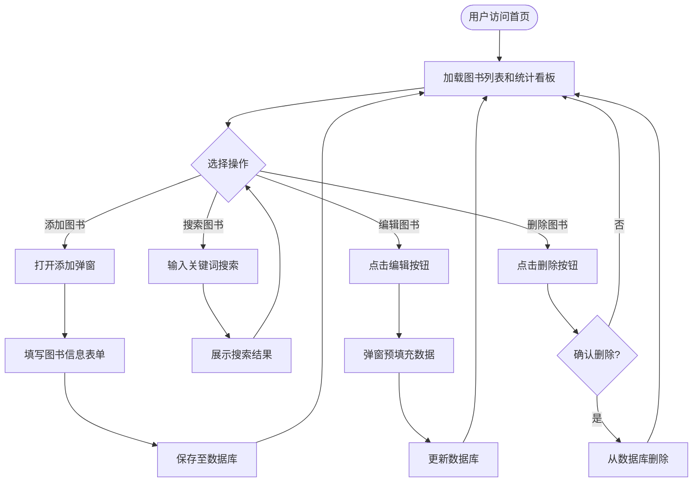
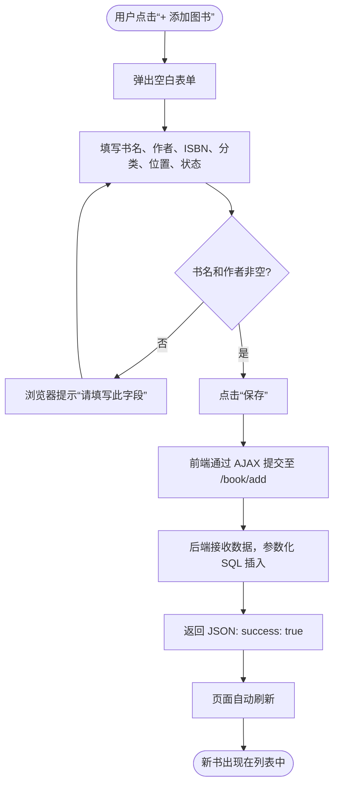
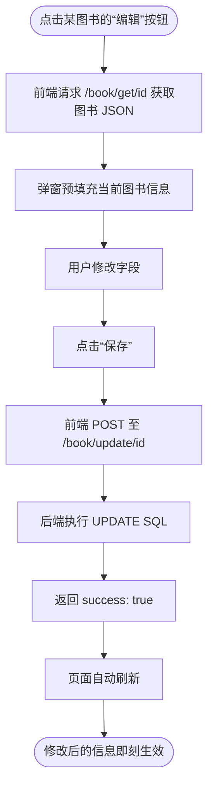
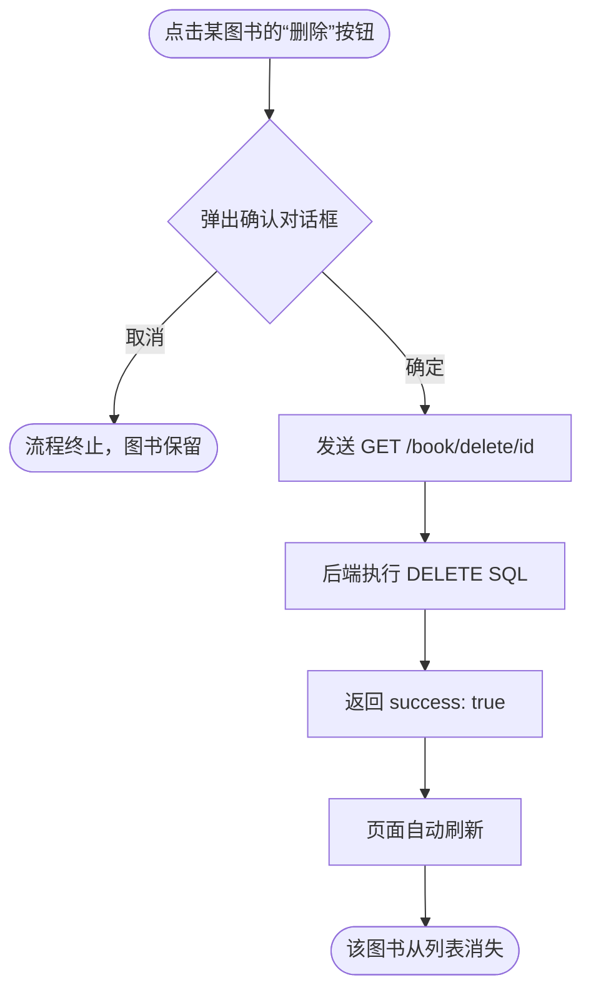
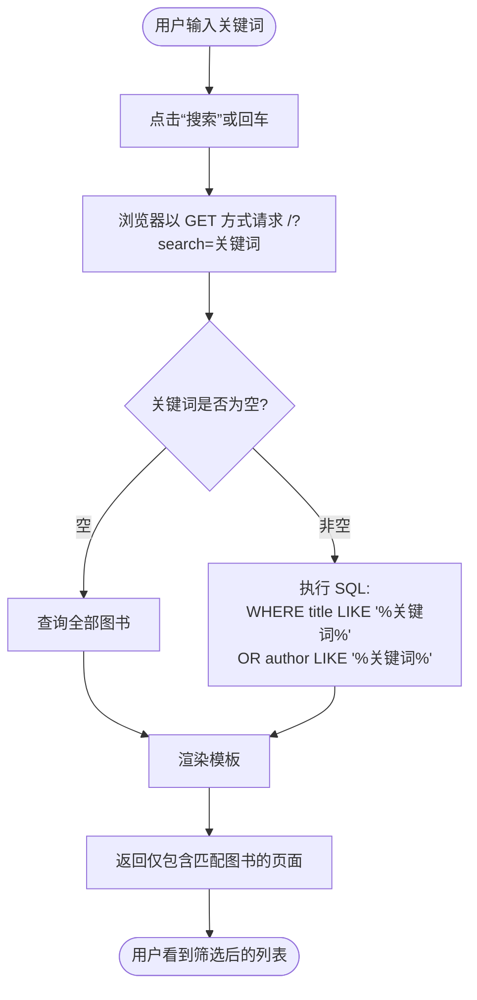
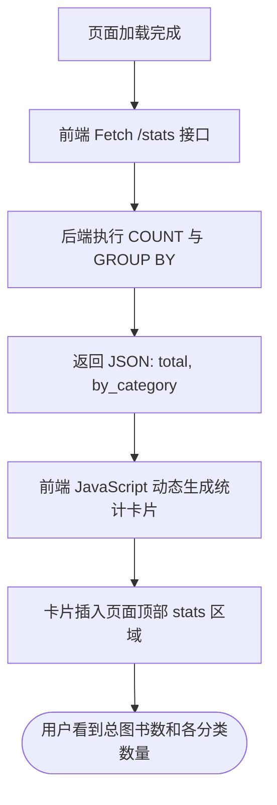

# 个人图书管理助手 - 业务流程图

**版本：** v1.0  
**作者：** 李淑湘  
**学号：** 202405550312  
**班级：** 计算机科学与技术菁英班  
**Git账号：** fdkshvn  
**日期：** 2026年5月11日  

---

## 1. 系统主流程

---

## 2. 添加图书流程

---

## 3. 编辑图书流程

---

## 4. 删除图书流程

---

## 5. 搜索图书流程

---

## 6. 统计看板加载流程（异步）

