# 个人图书管理助手 - 业务流程图

**版本：** v2.0  
**作者：** 李淑湘  
**学号：** 202405550312  
**班级：** 计算机科学与技术菁英班  
**Git账号：** fdkshvn  
**日期：** 2026年5月12日  

---

## 1. 系统主流程

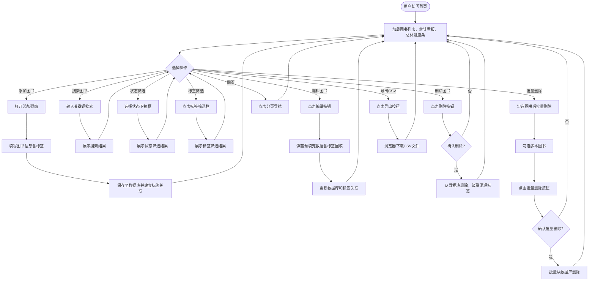

---

## 2. 添加图书流程（含标签）

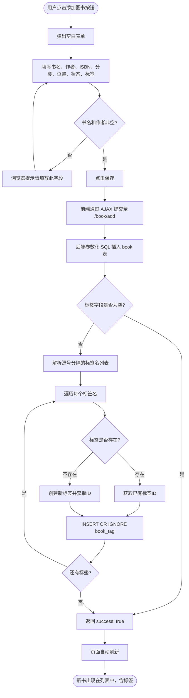

---

## 3. 编辑图书流程（含标签更新）

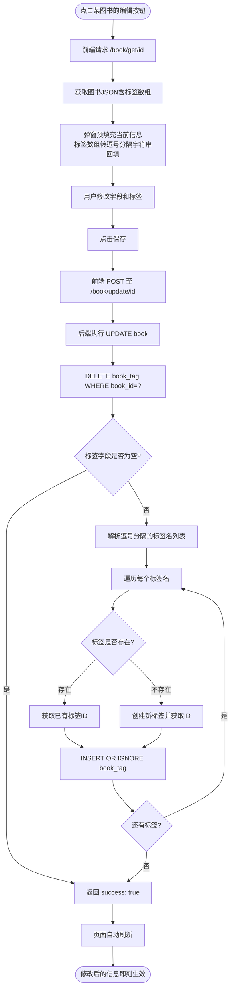

---

## 4. 删除图书流程

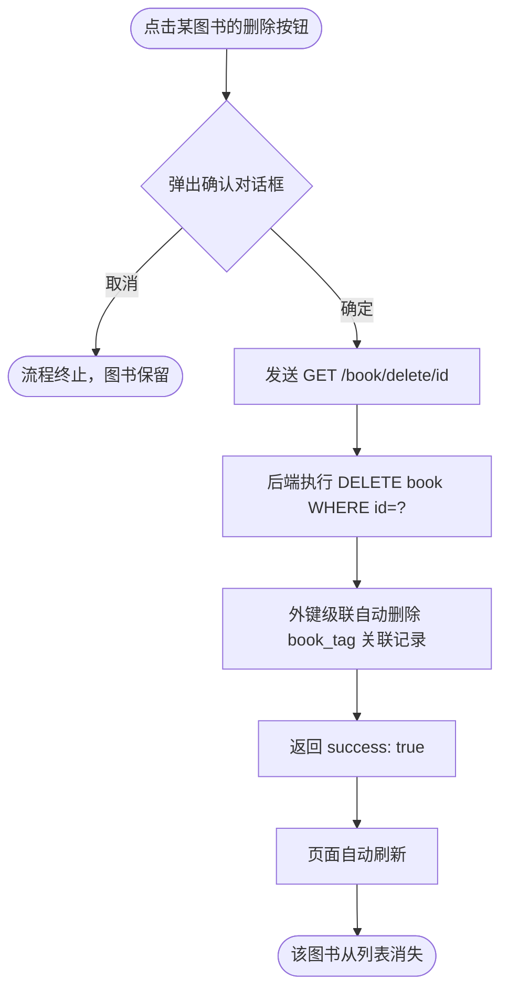

---

## 5. 批量删除流程

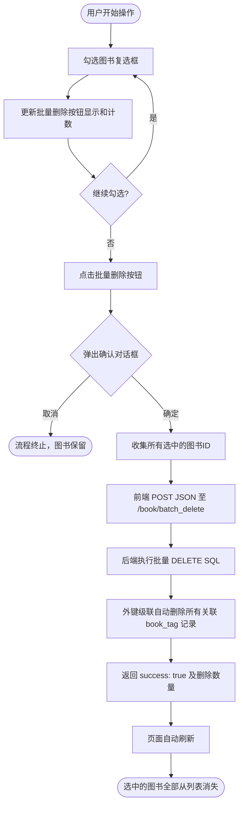

---

## 6. 搜索图书流程

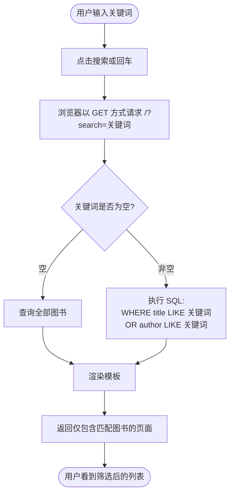

---

## 7. 按状态筛选流程

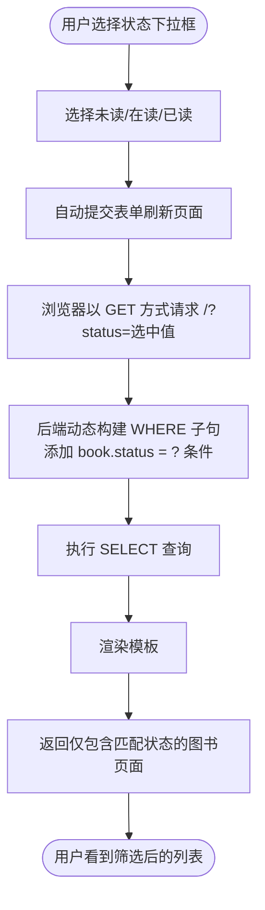

---

## 8. 按标签筛选流程

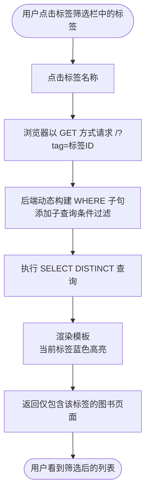

---

## 9. 三条件组合筛选流程

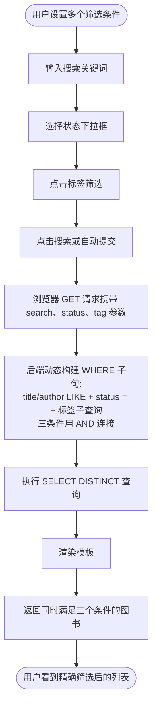

---

## 10. 导出CSV流程

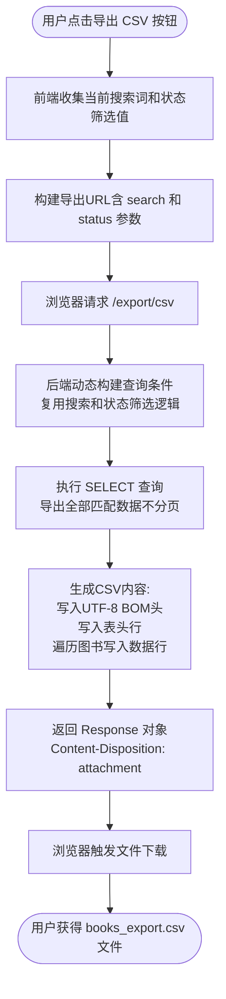

---

## 11. 统计看板与进度条加载流程

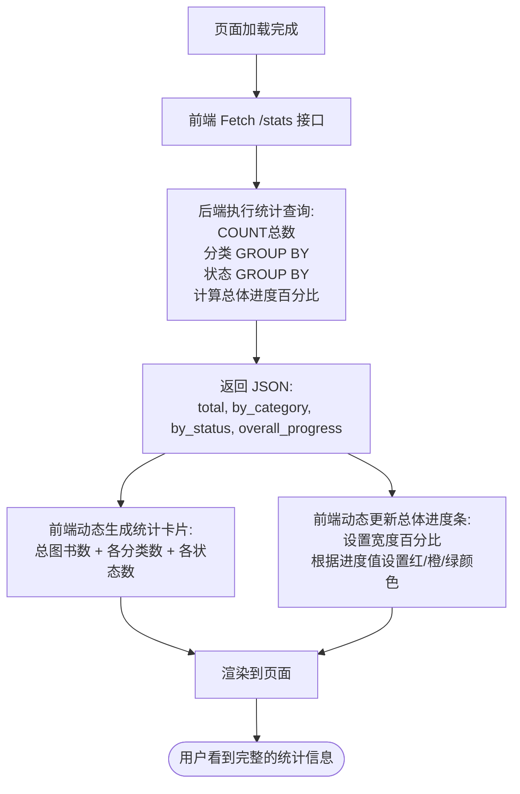

---

## 12. 分页导航流程

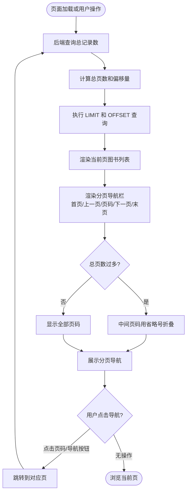