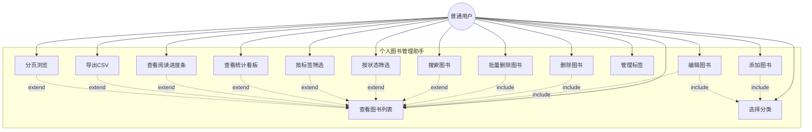

# 个人图书管理助手 - 用例图

**版本：** v2.0  
**作者：** 李淑湘  
**学号：** 202405550312  
**班级：** 计算机科学与技术菁英班  
**Git账号：** fdkshvn  
**日期：** 2026年5月12日  

---

## 1. 系统用例图

---

## 2. 用例图说明

**参与者：** 普通用户，系统的唯一使用者，拥有所有功能的操作权限。

**用例关系说明：**

| 关系类型 | 说明 | 涉及用例 |
|----------|------|----------|
| 包含（include） | 编辑和删除操作必须先查看图书列表；添加和编辑图书时可选择分类 | 编辑图书/删除图书/批量删除 → 查看图书列表；添加/编辑图书 → 选择分类 |
| 扩展（extend） | 搜索、筛选、统计、进度条、导出、分页是在查看图书列表基础上的增强功能 | 搜索/筛选/统计/进度条/导出/分页 → 查看图书列表 |

---

## 3. 用例简要描述

| 用例名称 | 参与者 | 简要描述 |
|----------|--------|----------|
| 添加图书 | 普通用户 | 用户通过弹窗表单录入书名、作者、ISBN、分类、位置、状态、标签等信息并保存，系统自动处理标签关联 |
| 编辑图书 | 普通用户 | 用户在图书列表中点击"编辑"，弹窗预填充当前信息（含标签回填），修改后保存更新 |
| 删除图书 | 普通用户 | 用户在图书列表中点击"删除"，确认后从系统中移除该图书记录，标签关联自动清理 |
| 批量删除图书 | 普通用户 | 用户勾选多本图书后点击"批量删除"，确认后一键移除，标签关联自动清理 |
| 查看图书列表 | 普通用户 | 系统以表格形式分页展示所有图书，包含ID、书名、作者、分类、标签、位置、状态、进度条 |
| 搜索图书 | 普通用户 | 用户在搜索框输入关键词，系统按书名或作者模糊匹配并筛选显示 |
| 按状态筛选 | 普通用户 | 用户通过状态下拉框选择"未读/在读/已读"，系统筛选显示对应状态的图书 |
| 按标签筛选 | 普通用户 | 用户点击标签筛选栏中的标签名，系统筛选显示含有该标签的图书 |
| 查看统计看板 | 普通用户 | 页面顶部动态展示图书总数、各分类数量、各状态数量统计卡片 |
| 查看阅读进度条 | 普通用户 | 页面显示总体阅读进度条（红/橙/绿三色）及每本图书的迷你进度条和状态徽章 |
| 选择分类 | 普通用户 | 添加或编辑图书时从预设分类（Java/Python/数据库/前端/其他）中选择 |
| 管理标签 | 普通用户 | 添加或编辑图书时输入标签名，系统自动查找已有标签或创建新标签并建立关联 |
| 导出CSV | 普通用户 | 用户点击"导出 CSV"按钮，系统将图书数据导出为CSV文件下载，支持筛选条件 |
| 分页浏览 | 普通用户 | 图书较多时通过底部页码导航翻页浏览，支持首页/末页快捷跳转 |

---

## 4. 用例场景示例

### 示例一：添加图书（含标签）

| 项目 | 内容 |
|------|------|
| 用例编号 | UC-01 |
| 用例名称 | 添加图书 |
| 参与者 | 普通用户 |
| 前置条件 | 用户已访问系统首页 |
| 基本事件流 | 1. 用户点击"+ 添加图书"按钮 2. 系统弹出空白表单 3. 用户填写书名、作者等必填信息，可选填ISBN、位置，选择分类和状态，输入标签名 4. 用户点击"保存" 5. 系统验证必填项，执行参数化插入数据库 6. 系统解析标签字段，查找或创建标签，建立关联 7. 系统刷新图书列表，新图书记录出现 |
| 后置条件 | 数据库中新增一条图书记录和对应标签关联，统计看板数据同步更新 |
| 异常事件流 | 若书名或作者为空，浏览器提示"请填写此字段"，阻止表单提交 |

### 示例二：批量删除图书

| 项目 | 内容 |
|------|------|
| 用例编号 | UC-04 |
| 用例名称 | 批量删除图书 |
| 参与者 | 普通用户 |
| 前置条件 | 系统中存在多本图书 |
| 基本事件流 | 1. 用户勾选多本图书的复选框 2. 系统显示"批量删除(N)"按钮 3. 用户点击"批量删除" 4. 系统弹出确认对话框 5. 用户点击"确定" 6. 系统批量删除选中图书及关联标签 7. 页面刷新 |
| 后置条件 | 选中的图书记录和标签关联被删除，其余图书保留 |
| 异常事件流 | 若未勾选任何图书，批量删除按钮不显示 |

### 示例三：三条件组合筛选

| 项目 | 内容 |
|------|------|
| 用例编号 | UC-06/07/08 |
| 用例名称 | 搜索+状态+标签组合筛选 |
| 参与者 | 普通用户 |
| 前置条件 | 系统中存在多本不同状态和标签的图书 |
| 基本事件流 | 1. 用户在搜索框输入"Spring" 2. 用户在状态下拉框选择"在读" 3. 用户点击标签"进阶" 4. 系统同时应用三个筛选条件 5. 显示同时满足书名含"Spring"、状态为"在读"、标签含"进阶"的图书 |
| 后置条件 | 页面仅显示满足全部条件的图书，分页和导出均基于当前筛选结果 |
| 异常事件流 | 若无满足条件的图书，显示"暂无图书数据" |