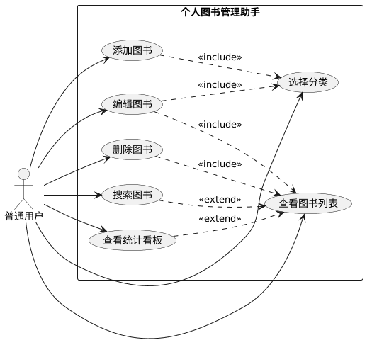

# 个人图书管理助手 - 用例图

**版本：** v1.0  
**作者：** 李淑湘  
**学号：** 202405550312  
**班级：** 计算机科学与技术菁英班  
**Git账号：** fdkshvn  
**日期：** 2026年5月11日  

---

## 1. 系统用例图

---

## 2. 用例图说明

**参与者：** 普通用户，系统的唯一使用者，拥有所有功能的操作权限。

**用例关系说明：**

| 关系类型 | 说明 | 涉及用例 |
|----------|------|----------|
| 包含（include） | 编辑和删除操作必须先查看图书列表，添加和编辑图书时可选择分类 | 编辑图书 → 查看图书列表；添加/编辑图书 → 选择分类 |
| 扩展（extend） | 搜索和统计是在查看图书列表基础上的增强功能 | 搜索图书/查看统计看板 → 查看图书列表 |

---

## 3. 用例简要描述

| 用例名称 | 参与者 | 简要描述 |
|----------|--------|----------|
| 添加图书 | 普通用户 | 用户通过弹窗表单录入书名、作者、ISBN、分类、位置、状态等信息并保存 |
| 编辑图书 | 普通用户 | 用户在图书列表中点击“编辑”，弹窗预填充当前信息，修改后保存更新 |
| 删除图书 | 普通用户 | 用户在图书列表中点击“删除”，确认后从系统中移除该图书记录 |
| 查看图书列表 | 普通用户 | 系统以表格形式展示所有图书，包含ID、书名、作者、分类、位置、状态 |
| 搜索图书 | 普通用户 | 用户在搜索框输入关键词，系统按书名或作者模糊匹配并筛选显示 |
| 查看统计看板 | 普通用户 | 页面顶部动态展示图书总数及各分类数量统计 |
| 选择分类 | 普通用户 | 添加或编辑图书时从预设分类（Java/Python/数据库/前端/其他）中选择 |

---

## 4. 用例场景示例

以“添加图书”为例的完整场景描述：

| 项目 | 内容 |
|------|------|
| 用例编号 | UC-01 |
| 用例名称 | 添加图书 |
| 参与者 | 普通用户 |
| 前置条件 | 用户已访问系统首页 |
| 基本事件流 | 1. 用户点击“+ 添加图书”按钮 2. 系统弹出空白表单 3. 用户填写书名、作者等必填信息，可选填 ISBN、位置，选择分类和状态 4. 用户点击“保存” 5. 系统验证必填项，执行参数化插入数据库 6. 系统刷新图书列表，新图书记录出现 |
| 后置条件 | 数据库中新增一条图书记录，统计看板数据同步更新 |
| 异常事件流 | 若书名或作者为空，浏览器提示“请填写此字段”，阻止表单提交 |